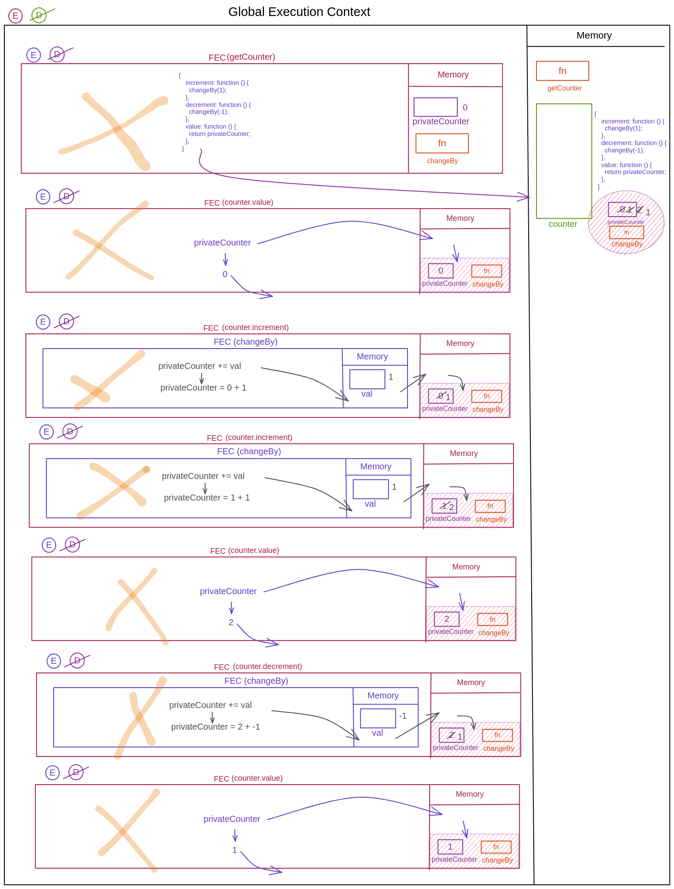

Create the execution context diagram for following code. What will be the output in each line of code

```js
function getCounter() {
  let privateCounter = 0;
  function changeBy(val) {
    privateCounter += val;
  }
  return {
    increment: function () {
      changeBy(1);
    },
    decrement: function () {
      changeBy(-1);
    },
    value: function () {
      return privateCounter;
    },
  };
}

let counter = getCounter();

counter.value(); // 0
counter.increment(); // undefined
counter.increment(); // undefined
counter.value(); // 2
counter.decrement(); // undefined
counter.value(); // 1
```



2. Create the execution context diagram and write the output.

```js
function makeCounter() {
  let privateCounter = 0;
  function changeBy(val) {
    privateCounter += val;
  }
  return {
    increment: function () {
      changeBy(1);
    },

    decrement: function () {
      changeBy(-1);
    },

    value: function () {
      return privateCounter;
    },
  };
}

let counter1 = makeCounter();
let counter2 = makeCounter();

console.log(counter1.value()); // prints 0 in console but returns undefined
counter1.increment();
counter1.increment();
console.log(counter1.value()); // prints 2 in console but returns undefined

counter1.decrement();
console.log(counter1.value()); // // prints 1 in console but returns undefined
console.log(counter2.value()); // prints 0 in console but returns undefined
```
