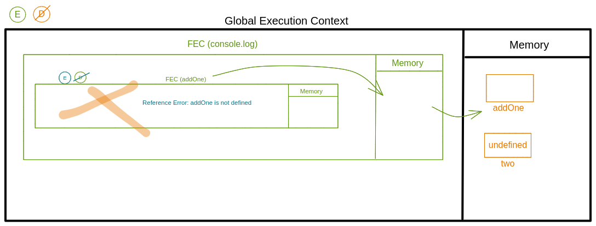

## Understanding Scope and the difference between var, let and const

Watch this video before doing the exercise: https://www.youtube.com/watch?v=XgSjoHgy3Rk

1. Guess the output:

```js
let firstName = "Arya";
const lastName = "Stark";
var knownAs = "no one";

console.log(window.firstName, window.lastName, window.knownAs); // undefined undefined "no one"
```

2. Guess the output:

```js
let firstName = "Arya";
const lastName = "Stark";
var knownAs = "no one";

function fullName(a, b) {
  return a + b;
}

console.log(window.fullName(firstName, lastName)); //AryaStark
```

3. Make a Execution Context Diagram for the following JS and write the output.

```js
function addOne(num) {
  return num + 1;
}
var one = addOne(0);
var two = addOne(1);
console.log(one, two); //1 2
```


4. Make a Execution Context Diagram for the following JS and write the output.

```js
var one = addOne(0);
function addOne(num) {
  return num + 1;
}
var two = addOne(1);
console.log(one, two); //1 2
```


5. Make a Execution Context Diagram for the following JS and write the output.

```js
console.log(addOne(0)); //1
function addOne(num) {
  return num + 1;
}
var two = addOne(1);
console.log(two); //2
```


6. Make a Execution Context Diagram for the following JS and write the output.

```js
var one = addOne(0); //Reference Error: addOne is not defined
const addOne = (num) => {
  return num + 1;
};
var two = addOne(1);
console.log(two);
```


7. Make a Execution Context Diagram for the following JS and write the output.

```js
console.log(addOne(0)); ////Reference Error: addOne is not defined
const addOne = (num) => {
  return num + 1;
};
var two = addOne(1);
console.log(two);
```



8. What will be the output of the following

```js
function isAwesome() {
  var awesome;
  if (false) {
    awesome = true;
  }
  console.log(awesome);
}
isAwesome(); //undefined
```

9. What will be the output of the following

```js
function isAwesome() {
  let awesome;
  if (true) {
    awesome = true;
  }
  console.log(awesome);
}
isAwesome(); //true
```

10. What will be the output of the following

```js
function isAwesome() {
  let awesome;
  if (false) {
    awesome = true;
  }
  console.log(awesome);
}
isAwesome(); //undefined
```

11. What will be the output of the following

```js
let firstName = "Arya";
const lastName = "Stark";
var knownAs = "no one";

function fullName(a, b) {
  return a + b;
}
const name = fullName(firstName, lastName);
console.log(name); //"AryaStark"
```

12. Guess the output of the code below with a reason.

```js
function sayHello() {
  let name = "Arya Stark";
}
sayHello();

console.log(name); //"" since here console.log canr access name variable inside sayHello function but by default name variable is defined in a windows as "" so window.name is predefined.
```

13. Guess the output of the code below with a reason.

```js
if (true) {
  var name = "Arya Stark";
}
console.log(name); //"Arya Stark" since var is function scoped and not blocked scope so name = "Arya Stark" will be defined in Global Scope. So window.name = "Arya Stark"
```

14. Guess the output of the code below with a reason.

```js
if (true) {
  let name = "Arya Stark";
}
console.log(name); //"" Here also console.log cant access name variable inside if block sine let is blocked scope. But name is predefined in a window to be "". so output will be ""
```

15. Guess the output of the code below with a reason.

```js
for (var i = 0; i < 20; i++) {
  //
}
console.log(i); //20 since i is declared with var so it is declared in global scope. Hence we can access i variable from outside of block.
```

16. Guess the output of the code below with a reason.

```js
for (let i = 0; i < 20; i++) {
  //
}
console.log(i); //Reference Error: i is not defined. Since here i is declared using let keyword. It is block scoped so console.log cant access a variable inside block.
```

17. Guess the output and the reason behind that.

```js
function sample() {
  if (true) {
    var username = "John Snow";
  }
  console.log(username);
}
sample(); //John Snow since username declared with var so accessible to all inside the sample function scope.
```

18. Guess the output and the reason behind that.

```js
function sample() {
  if (true) {
    let username = "John Snow";
  }
  console.log(username);
}
sample(); //Reference Error: username is not defined., since username declared with let so it is not accessible outside the if block.
```

19. Guess the output and the reason behind that.

```js
function sample() {
  var username = "Arya Stark";
  if (true) {
    var username = "John Snow";
    console.log(username);
  }
  console.log(username, "second");
}
sample(); //John Snow since username value is overwritten by John Snow.
// John Snow second since username is declared with var inside if block so it overwrite the first time username is declared. So accessing username inside function will give John Snow as output
```

20. Guess the output and the reason behind that.

```js
function sample() {
  let username = "Arya Stark";
  if (true) {
    let username = "John Snow";
    console.log(username, "first");
  }
  console.log(username, "second");
}
sample(); //John Snow first since they are inside same block
//Arya Stark second since let is block scope so outside if block let is defined as Arya Stark
```

21. Guess the output and the reason behind that.

```js
function sample(...args) {
  for (let i = 0; i < args.length; i++) {
    let message = `Hello I am ${args[i]}`;
    console.log(message);
  }
}

sample("First", "Second", "Third"); // Hello I am First
//Hello I am Second
//Hello I am Third
//since let is blocked scope.
```

22. Guess the output and the reason behind that.

```js
function sample(...args) {
  for (let i = 0; i < args.length; i++) {
    const message = `Hello I am ${args[i]}`;
    console.log(message);
  }
}

sample("First", "Second", "Third");
//Hello I am First
//Hello I am Second
//Hello I am Third
//since const is blocked scope.
```

23. Guess the output and the reason behind that.

```js
if (true) {
  const myFunc = function () {
    console.log(username, "Second"); // if error ignored then output will be Hello World!
  };
  console.log(username, "First"); //Reference Error: Cannot access username before initialisation
  let username = "Hello World!";
  myFunc();
}
//Error since username is defined with let so initially it doesnt hold any value and is not initialised.
```

24. Guess the output and the reason behind that.

```js
function outer() {
  let movie = "Mad Max: Fury Road";
  function inner() {
    console.log(`I love this movie called ${movie.toUpperCase()}`);
  }
  inner();
}

outer(); //I love this movie called MAD MAX: FURY ROAD
//let is function and block scoped so any function inside the outer function can access the movie variable.
```

25. Guess the output and the reason behind that.

```js
function outer() {
  let movie = "Mad Max: Fury Road";
  function inner() {
    let movie = "Before Sunrise";
    console.log(`I love this movie called ${movie.toUpperCase()}`);
  }
  inner();
}

outer(); //I love this movie called BEFORE SUNRISE
// since movie = "Before Sunrise" is locally defined so console.log will first access the locally available variable.
```

26. Guess the output and the reason behind that.

```js
function outer() {
  let movie = "Mad Max: Fury Road";
  function inner() {
    let movie = "Before Sunrise";
    function extraInner() {
      let movie = "Gone Girl";
      console.log(`I love this movie called ${movie.toUpperCase()}`);
    }
    extraInner();
  }
  inner();
}
outer(); //I love this movie called GONE GIRL
// since movie = "Gone Girl" is locally defined so console.log will first access the locally available variable.
```

30. Using reduce find the final value when the initial value passed is `100`. You have to pass the output of one function into the input of next function in the array `allFunctions` starts with `addOne` ends with `half`.

```js
const addOne = (num) => {
  return num + 1;
};
const subTwo = (num) => {
  return num - 2;
};
const multiplyThree = (num) => {
  return num * 3;
};
const half = (num) => {
  return num / 2;
};

let allFunctions = [addOne, subTwo, multiplyThree, addOne, multiplyThree, half];
allFunctions.reduce((acc, elm) => elm(acc), 100);
// Answer is: 447
```
